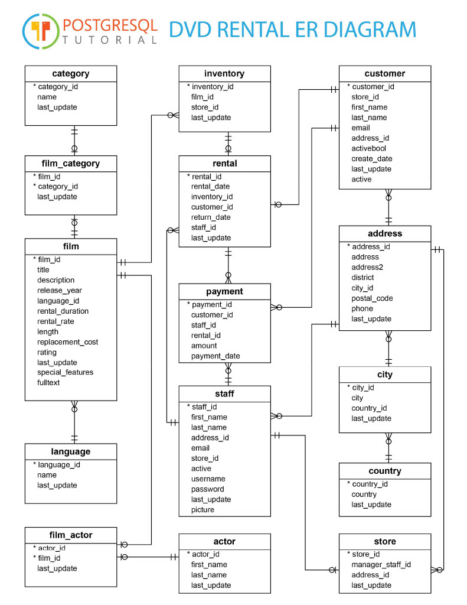

# dvdstore

Sample project with PETRONAS Serverless best practices and such!

# Goal/Success Criteria:

### Development:

- Implement the following database using typeORM
  
- Write CRUD RestController On Each Resource
- Write Service Layer
- Write Repository Layer
- Implement Authentication
- Implement Authorization
- Implement Oauth/OpenID full cycle including MFA + Social Login on top of Cognito
- Implement File Upload
- Implement File Download
- Integrate Stripe (Or Other Payment gateway)
- Implement Error/Warning/Info/Debug/Trace Level Logging with correlation id.
- Write Unit test with mocking
- Write Integration test

### Devops:

- Run and Debug serverless app in local
- Implement X-Ray tracing
- Implement Continuous Integration pipeline with sonarcube, husky, test runner, linting
- Implement Continuous Delivery(Automatic Release) in github.
- Implement Continuous Deployment in AWS with IAC and SSM integration.
- Implement Serverless Observability

### Danger level:

- X-Ray instrumentation across service boundary (API-SNS-SQS-SFN), implement a workflow using SFN based on user input.

# Learning mechanism:

Weekly session at office to update what we learn.
